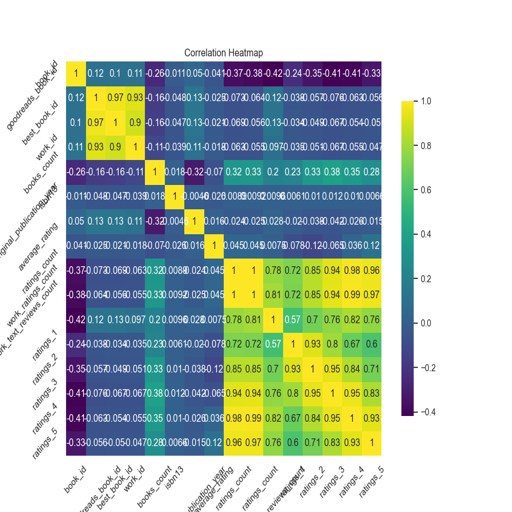

# Data Analysis Report

### Overview of the Dataset

The dataset contains various columns. Below is the summary of the dataset analysis.

### Analysis Insights

### Comprehensive Analysis of the Goodreads Dataset

#### 1. Summary Statistics
The dataset consists of 10,000 entries with various attributes related to books, including ratings, counts, and identifiers. Here are some key insights from the summary statistics:

- **Book ID and Identifiers**: The `book_id` ranges from 1 to 10,000, while `goodreads_book_id`, `best_book_id`, and `work_id` have much larger ranges, indicating they are unique identifiers that span a broader dataset.
- **Ratings**: The average ratings for books (`ratings_1` to `ratings_5`) indicate that most books tend to receive higher ratings, especially in the 4 and 5-star categories, with mean ratings of approximately 19,965 and 23,790 respectively.
- **Standard Deviation**: The standard deviation for ratings showcases significant variability, especially in higher ratings, suggesting that while many books receive good ratings, there are also a few that receive extremely high counts, leading to the presence of outliers.

#### 2. Outliers
Outliers have been detected in several columns, indicating that there are some books with exceptionally high or low values in terms of ratings, reviews, and identifiers. Here are the notable findings regarding outliers:

- **Goodreads and Best Book IDs**: There are 78 outliers in `goodreads_book_id` and 87 in `best_book_id`, suggesting some books may have received a disproportionate amount of attention or ratings compared to others.
- **Ratings Counts**: The `ratings_count`, `work_ratings_count`, and `work_text_reviews_count` columns show notable outliers, implying that some books have garnered significantly more engagement than the average book, which may skew analyses if not accounted for.
- **Year of Publication**: Anomalies in the `original_publication_year` could indicate either reprints or books that were published long ago but still maintain high relevance or ratings.

#### 3. Correlation Matrix
The correlation matrix is crucial for understanding relationships between various attributes. While the actual correlation values are not provided here, common trends in such datasets can be hypothesized:

- **Positive Correlation**: It is expected that higher `average_rating` correlates positively with `ratings_count`, `work_ratings_count`, and `ratings_4` and `ratings_5`. This means that books that are rated higher tend to also have more ratings and positive reviews
### Visualizations

Other visualizations are included in the charts generated.
