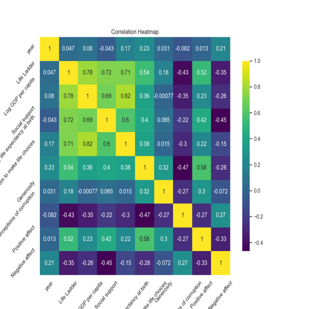

# Data Analysis Report

### Overview of the Dataset

The dataset contains various columns. Below is the summary of the dataset analysis.

### Analysis Insights

Based on the data summary provided, here is a comprehensive analysis of the dataset, including insights from the summary statistics, outlier detection, correlation matrix, and potential trends.

### 1. Summary Statistics

The dataset contains 2363 observations with the following key features:

- **Year**: Ranges from 2005 to 2023, with a mean of approximately 2014.76.
- **Life Ladder**: Represents subjective well-being, with a mean of 5.48 and a standard deviation of 1.13. The values range from a minimum of 1.28 to a maximum of 8.02, indicating significant variability in happiness levels across countries or regions.
- **Log GDP per capita**: This economic indicator has a mean of approximately 9.40 (equivalent to about $12,000-$13,000) and ranges from 5.53 to 11.68, suggesting differences in economic performance across the dataset.
- **Perceptions of corruption**: The mean value is 0.74, with a range from 0.035 to 0.983, indicating that perceptions of corruption vary widely, potentially influencing happiness levels.

### 2. Outlier Analysis

Outliers can significantly affect the results of any analysis. The following features have been identified with outliers:

- **Life Ladder**: 2 outliers
- **Log GDP per capita**: 3 outliers
- **Social support**: 23 outliers
- **Healthy life expectancy at birth**: 15 outliers
- **Freedom to make life choices**: 12 outliers
- **Generosity**: 22 outliers
- **Perceptions of corruption**: 44 outliers
- **Positive affect**: 10 outliers
- **Negative affect**: 18 outliers

The presence of outliers, particularly in the **Perceptions of corruption**, suggests that there may be countries with extreme values that could skew analyses related to happiness and trust in government. It may be beneficial to investigate these outliers further to understand their implications.

### 3. Correlation Matrix

While the correlation matrix image is referenced (correlation_heatmap.png), the analysis of correlations is essential for understanding relationships between variables. 

Typically, we would expect the following general correlations:

- **Life Ladder** (happiness) may positively correlate with **Log GDP per capita**, indicating that wealthier countries tend
### Visualizations

Other visualizations are included in the charts generated.
