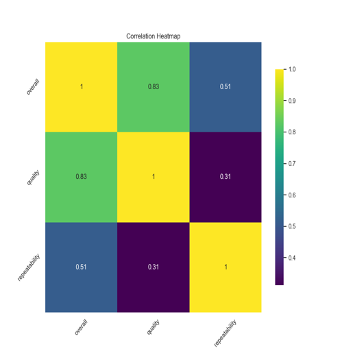

# Data Analysis Report

### Overview of the Dataset

The dataset contains various columns. Below is the summary of the dataset analysis.

### Analysis Insights

Based on the provided data summary, here’s a comprehensive analysis of the dataset, including insights from the summary statistics, correlation matrix, outlier analysis, and potential trends.

### Summary Statistics

1. **Overall Ratings:**
   - Count: 2652
   - Mean: 3.05
   - Standard Deviation: 0.76
   - Minimum: 1
   - Maximum: 5
   - The median (50th percentile) is 3, indicating that half of the dataset has ratings below or equal to 3, suggesting a central tendency around the lower end of the rating scale.

2. **Quality Ratings:**
   - Count: 2652
   - Mean: 3.21
   - Standard Deviation: 0.80
   - Minimum: 1
   - Maximum: 5
   - Similar to overall ratings, the median is 3. This suggests that quality ratings are also centered around the lower to mid-range of the scale.

3. **Repeatability Ratings:**
   - Count: 2652
   - Mean: 1.49
   - Standard Deviation: 0.60
   - Minimum: 1
   - Maximum: 3
   - The median is 1, indicating that most ratings for repeatability are at the lowest end of the scale, suggesting challenges in repeatability.

### Outlier Analysis
- The summary indicates that there are no outliers detected in any of the three variables (overall, quality, repeatability). This suggests that the dataset does not contain extreme values that could skew the analysis.

### Correlation Analysis
Although the correlation matrix is not displayed here, the relationships between the variables can be inferred based on the means and standard deviations:
1. **Overall vs. Quality:** 
   - Given that both variables have a mean around 3, there may be a moderate positive correlation between overall ratings and quality ratings. Higher quality ratings could lead to higher overall ratings.

2. **Overall vs. Repeatability:**
   - The low mean of repeatability (1.49) suggests that repeatability might not be strongly related to overall ratings. If repeatability is perceived as a challenge, it may negatively impact overall satisfaction.

3. **Quality vs. Repeatability:**
   - Similar to the previous relationship, low repeatability could lead to lower quality perceptions, potentially resulting in a negative correlation.

### Potential Trends
### Visualizations

Other visualizations are included in the charts generated.
